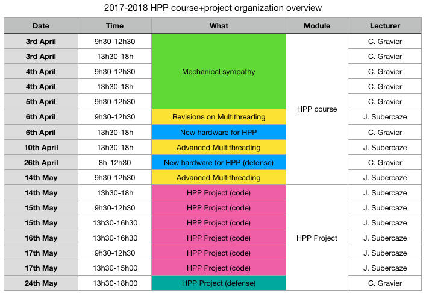

# Module FISE2 - HPP 2016-2017

## Introduction to this course

This course introduces paradigms, concepts and tools for creating and benchmarking high-performance computer programs.
For the past years, the trend has been to scale by distributing applications to different servers.
While this is of the utmost practical interest for large-scale applications, it also comes with a significant I/O penalty as we will see in this module.

In this course, we will be focusing on how to make a single node (your laptop, a commoditiy server, ...) applications efficient in terms of performances.

For this, we will explore optimlizations techniques based on two main paradigms :
- [Mechanical Sympathy](http://mechanical-sympathy.blogspot.fr/) : we will discover how modern computer architecture can influence the pratical efficiency of various algorithms. We will especially study the effect of the cache hierarchy, the CPU pipelines mechanisms, and the usage of CPU instruction sets (especially [SIMD instructions](https://www.kernel.org/pub/linux/kernel/people/geoff/cell/ps3-linux-docs/CellProgrammingTutorial/BasicsOfSIMDProgramming.html)).
- [Multithreading](http://docs.oracle.com/javase/tutorial/essential/concurrency/procthread.html) : we will observe diffferent scenario in which a programmer can identify that his program is memory, cpu or I/O limited. From these observations, we will then see different techniques for handling synchronisation when programming parallelism at the computer level (barriers, latches, CAS instructions). Architectures and good/bad practises of such multitheaded programs will also be studied.

Earlier, the first part (Mechanical Sympathy) will be offered in **C++**, while the latter (Multithreading) will be offered in **Java**.
This year, both are given in **Java** with respect to feedback of former students.

Ultimately, you will put your newly acquired skills and mindset to a HPP project running after the HPP course itself (see organization of the module below).

## Organization

The timeframe for the aforementionned activities is as provided by the following picture :

The two instructors for this course are (by order of appearance) :
- Christophe Gravier <christophe.gravier@univ-st-etienne.fr>
- Julien Subercaze <julien.subercaze@univ-st-etienne.fr>

## Evaluation

You will have a total of 5 marks as follows (each colour in the previous organization table leads to notation).

HPP course :
- [30%] Your code on mechanical sympathy delivered for the 15th April 2018 [here](https://mootse.telecom-st-etienne.fr/mod/assign/view.php?id=13592)
- [30%] Your code on advanced multithreading delivered for the 18th May 2018 [here](https://mootse.telecom-st-etienne.fr/mod/assign/view.php?id=13593)
- [40%] Your defense on new hardaware for HPP on the 26th April 2018

HPP Project :
- [50%] Your code for the project delivered for the 24th May 2018 [here](https://mootse.telecom-st-etienne.fr/mod/assign/view.php?id=13594)
- [50%] Your defense for the HPP project on the 24th May 2018 (no slides, presentation of architecture and results on your computer)

## Labs materials

- [Mechanical sympathy](./lab1/README.md)
- [Multithreading](./lab2/README.md)
- [New hardware for HPP](./lab3/README.md)
- [HPP Project](./project/README.md)
