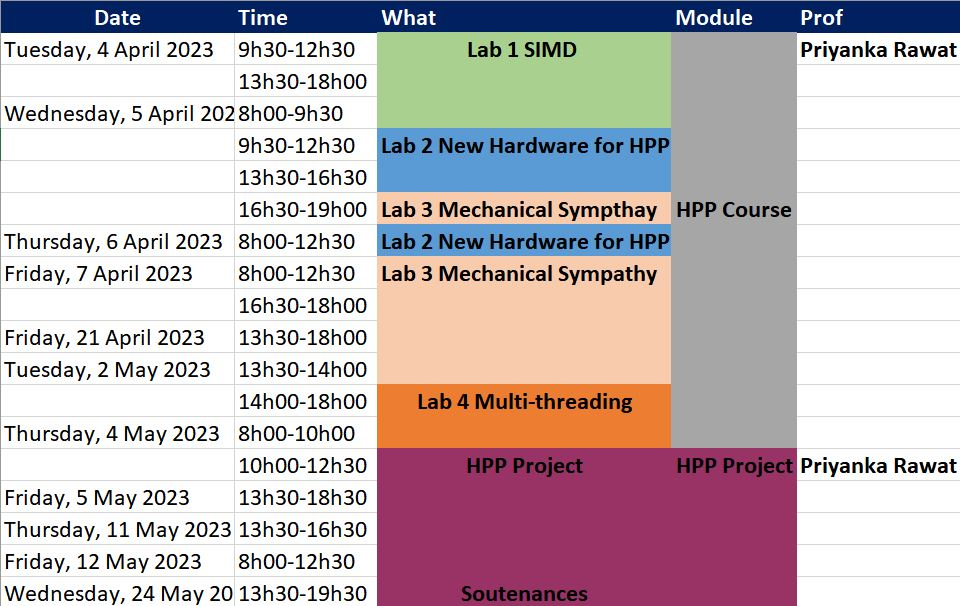

# Module FISE2 - HPP 2022-2023

## Introduction to this course

This course introduces paradigms, concepts and tools for creating and benchmarking high-performance computer programs.
For the past years, the trend has been to scale by distributing applications to different servers.
While this is of the utmost practical interest for large-scale applications, it also comes with a significant I/O penalty as we will see in this module.

In this course, we will be focusing on how to make a single node application (running on your laptop, a commodity server...) efficient in terms of performance.

For this, we will explore optimizations techniques based on four main directions:
- **Lab1:** Have a look at specific processor instructions, like [SIMD instructions](https://www.kernel.org/pub/linux/kernel/people/geoff/cell/ps3-linux-docs/CellProgrammingTutorial/BasicsOfSIMDProgramming.html), particularly MMX/SSE/AVX for Intel processors, and how/when they can help in our quest for performance.
- **Lab2:** Do some technology watch to discover how new hardware/algorithms/tools that emerged in the past year(s) can help.
- **Lab3:** Study how modern computer architecture ([Mechanical Sympathy](http://mechanical-sympathy.blogspot.fr/)) can influence the practical efficiency of various algorithms. We will especially study the effect of the *cache hierarchy*, the *CPU pipelines* mechanisms.
- **Lab4:** [Multithreading](http://docs.oracle.com/javase/tutorial/essential/concurrency/procthread.html) : we will observe different scenarios in which a programmer can identify that his program is memory-, cpu- or I/O-limited. From these observations, we will then see different techniques for handling synchronisation when programming parallelism at the computer level (*barriers*, *latches*, *CAS instructions*). Architectures and good/bad practices of such Multi-Threaded programs will also be studied.
- **Project:** In the end you'll practice your newly acquired skills and mindset on the resolution of a complex problem during the final project.

Most of the Labs will be offered in **Java** as this is the language you have learned this year. However, the SIMD part will be offered in **C++**, as this language allows simpler access to low-level processor instructions.

## Organization

The timeframe for the aforementionned activities is as provided by the following picture:

Instructor for this course :
- Priyanka Rawat 

## Evaluation

You will have a total of 5 grades as follows (each color in the previous organization table leads to notation).

HPP course:
- [25%] Your code on "SIMD" (Exercice 4) delivered for the **12 April 2023** [here](https://mootse.telecom-st-etienne.fr/mod/assign/view.php?id=13598)
- [25%] Your presentation on "Emerging Technologies for HPP" ("New Hardware for HPP") for the **6 April 2023** [here](https://mootse.telecom-st-etienne.fr/mod/workshop/view.php?id=27349)
- [25%] Your code on "Mechanical Sympathy" delivered for the **2 May 2023** [here](https://mootse.telecom-st-etienne.fr/mod/assign/view.php?id=13592)
- [25%] Your code on "Multi-Threading" delivered for the **4 May 2023** [here](https://mootse.telecom-st-etienne.fr/mod/assign/view.php?id=13593)

HPP Project:
- [50%] Your code for the project delivered for the **20 May 2023** [here](https://mootse.telecom-st-etienne.fr/mod/assign/view.php?id=17102)
- [50%] Your defense for the HPP project on the **24 May 2023** (a few slides to introduce the architecture of your solution and your results, then the rest directly on your computer)

## Labs materials

- [SIMD](./lab1-SIMD/README.md)
- [Emerging Technologies in HPP](./lab2-EmergingTech/README.md)
- [Mechanical Sympathy](./lab3-MechanicalSympathy/README.md)
- [Multi-Threading](./lab4-MultiThreading/)
- [HPP Project](./project/README.md)
