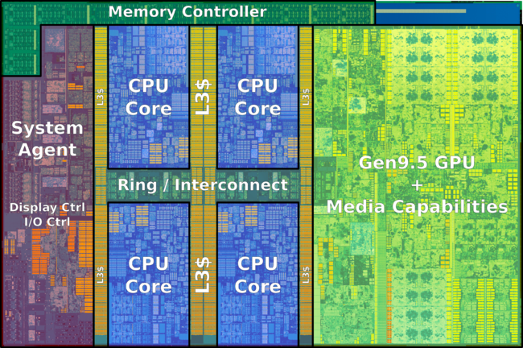
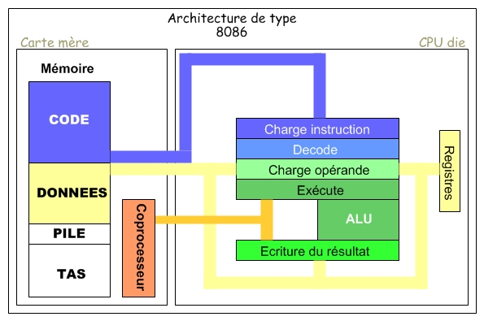

# Mechanical Sympathy

It is quite obvious that when the CPU execute an instruction, it does not fetch the data each time from memory - this will make it wait too many cycles to actually get the data (waiting for it) before actually processing it. This observation is even more true considering the _Memory Wall_.


> Task : Watch [the following video](https://www.youtube.com/watch?v=1_mjiQesgGI) to understand what is the memory wall


You can have the intuition that different levels of _caches_ store those data so that the CPU can have a fast access to them when required (aka __Memory Hierarchy__)

The real questions are :
- How many levels of caches does a CPU have ?
- How many times (number of CPU cycles) does it take to fetch a data from the memory to each of these cache ?
- How the CPU handle cache accesses while still actually executing instructions?
- Last but not least : **Why do these low-level considerations are of the utmost practical interest for the programmer ?**

In what follows, different programming activities will make your observe and then conclude on answers to those questions.
** Write down your notes in a document, you will need to submit it along your code for the mechanical sympathy part**

## Who is actually executing your instructions?

As a warm-up, we want to get an idea on the architecture of our CPU(s) that is actually handling data in our algorithms. All CPUs are not the same, right?

Take the example of the micro architectureof a 2019 intel-based mac notebook :



As a large number of modern processors, its architecture uses three level of cache : Level 1 (L1), Level 2 (L2), and Level 3 (L3 -- sometimes: Last Level Cache (LLC)). This is a very common cache hierarchy architecture.

> Task : What is your processor ? What is its cache hierarchy ? What are the sizes and latencies of each data storage units (cache and main memory) ?
> 
We will here review the building blocks of the architecture of a CPU, caches and memory, along the main concepts to understand. 

> Task : What is the virtual memory and what is a cache line ?  
For virtual memory, this [link should help you](https://medium.com/@SravanthiSinha/all-about-the-virtual-memory-1c8a3cf306b7)  
For cache lines, this [link should help you](https://medium.com/software-design/why-software-developers-should-care-about-cpu-caches-8da04355bb8a).

> Task: What is the purpose of the Translation Lookaside Buffer ?
Read: [Go through this](https://www.geeksforgeeks.org/translation-lookaside-buffer-tlb-in-paging/)

> Task : The link above illustrated how array design impact performances. But the algorithm itself also matters. Discover [Amdahl's law](https://en.wikipedia.org/wiki/Amdahl%27s_law)

> Task: What are the usual way to associate cache lines with the main memory ?
Read: [this](https://en.wikipedia.org/wiki/CPU_cache#/media/File:Cache,associative-fill-both.png)

> Task: Do you remember the difference between a process and a thread and therefore bewteen mutli-threading and mutli-processing ?

> Task : What is hyperthreading ?  

> Side remarks: on multi-threadfing and multi-processing in Python [here](https://medium.com/mindful-engineering/multithreading-multiprocessing-in-python3-f6314ab5e23f)

> Task : Why all this matters ? (_we will discuss some numbers every programmers should know_)

> Task : Create a simple block diagram of your processor, including all its cores, all level of cache, main memory and disk. Add latency and size numbers.

If you are using Linux, it's payback time :) Try:
```
sudo apt install hwloc 
lstopo 
```

## At execution time

> Task : Connect the dots: Watch the following awesome videos on CPU pipeline :   

- [Pipelining concept](https://www.youtube.com/watch?v=otSXgSp-8EY&list=PLAwxTw4SYaPmqpjgrmf4-DGlaeV0om4iP&index=60). 

- [Pipelining in a processor](https://www.youtube.com/watch?v=eVRdfl4zxfI&list=PLAwxTw4SYaPmqpjgrmf4-DGlaeV0om4iP&index=61). 

- [Pipeline stalls](https://www.youtube.com/watch?v=ltRlHzOSOzY&list=PLAwxTw4SYaPmqpjgrmf4-DGlaeV0om4iP&index=67). 

- [Pipeline flushes](https://www.youtube.com/watch?v=mGlwrbEtMOs&list=PLAwxTw4SYaPmqpjgrmf4-DGlaeV0om4iP&index=68). 

- Look also at the additional quizzes on pipelining for laundry and instructions in the same videos series.


> What are modern numbers of pipeline stages ? 

PS: The following block schema of a processor can help you (remind that every processor is different) :



## Play time !

In what follows, we will create some Java programs in order to observe the effect of the cache hierarchy on simple data structure tasks.

You are strongly encourage to first read [a very nice document from U. Drepper](https://people.freebsd.org/~lstewart/articles/cpumemory.pdf). - mostly pages 15 -- 24. Don't expect everything to make sense, but be sure to read again this passage before the "Discover JMH" section.


## Read Walks using arrays

### Utility function
In what follows, we will need to be able to build fixed-size arrays of `2^k` bytes.
For this purpose, we will be creating arrays of random `int`s, provided that your JVM stores `int`s as 32 bits (4 bytes).
When we want to build arrays of `2^k` bytes, we will be building arrays of `(2^k) / 4` random `int`'s.

> Task : Write a Java class that expose a single static function to create such an array, whose size is given as parameter. That is write `public static int[] makeArray(int k)`.

### On measuring execution time

We want to measure the time needed to walk the entire array from the beginning to its end, in a sequential way. In order to measure the time spent, we will be using two methods :

1) A first approximation using `System.nanoTime()`

By measuring the time before running your code traversing the array, and compute the difference with the time after your program terminates.

	// ... Building the 2^k array
	long startTime = System.nanoTime();    
	// ... traversing each item of the array ...    
	long estimatedTime = System.nanoTime() - startTime;

2) CPU time using `jvisualvm`.

Along your JDK comes a nice tools to profile your running java program which is called `jvisualvm`. If you got the the `bin`folder of your installed JVM, you can launch it from there. 

If you don't find it, you can downlaod it as a standalone from [here](https://visualvm.github.io)

For profiling CPU, the basis of what we'll need are [here](https://www.vneuron.com/2018/01/23/profile-your-java-application-with-visualvm-part-1-of-2). 
 

> Task : Explain the difference between the two ways of measuring elapsed time.

### Sequential read walk

We want to measure the elapsed time for walking the entire arrays of the following dimensions : `k = {20 .. 32}`.

> Task : Code the sequential array traversal and measuring the elapsed time for each values of k. Plot the results and make a guess on execution time for greater values. At each operation make something of `yourArray[i]`, for instance I suggest that you compute the cumulated sum of int in the table (let's ignore `ìnt`overflows as we won't do anything with this value).

> Task : Do the same thing but traversing the array sequentially from end to start.


### Random read walk

We now want to walk `(2^k / 4`) random values from the array (maybe with repetitions). `(2^k / 4)` is the number of `int`'s in the array, so we want to fetch as many `int`from the array while preventing a sequential access. At each iteration, you will be choosing the index `i` of the array cell you want to pick from a pseudo random generator bounded in `[0; 2^k / 4 -1]`. For such generator, looking on stackoverflow can lead you to [interesting piece of code](http://stackoverflow.com/questions/363681/generating-random-integers-in-a-specific-range).

Or, you are more clever and you make an array of the first `(2^k / 4 -1 - 1` integer, shuffle that array, and use the value as the next index to fetch.

> Task : Code the random (with possible repetitions) walk of arrays with different values for k, i.e.  `k = {20 .. 32}`.

> Task : How do a sequential and a random walk compares ? What is your intuition behind this ? (next activity covers the study of your possible intuition(s).

### CPU counters using perf

> Task : Run both a sequential and random walk of the array (for instance for k = 24) and observe CPU cycles using the [perf](https://perf.wiki.kernel.org/index.php/Main_Page) Linux tool installed on your machines.
__Here we will discuss pipeline stalling (bubbles) and NUMA accesses__

Note: even `perf`is [not perfect](https://www.uninformativ.de/blog/postings/2021-08-19/0/POSTING-en.html)! 

## Read Walks using linked list

In this part we will be interested in traversing a linked list in a sequential manner for varying cell size in bytes. We will study the impact of traversing a linkedlist that lies in a noncontiguous space. Remember that traversing a linkedlist is not prefetched by current CPUs -- although you can see [some proposal in the academic literature](https://dl.acm.org/doi/10.1145/291069.291034).


### LinkedList in a non-contiguous space

> Task : Provide another method to build a `Liste` so that you are no longer guaranteed that the `liste`elements lie in a contiguous memory space. 

It is possible that, although not instanciated within an array, that the consecutive call to `new Liste` will tend to instanciate the Liste elements in a contiguous manner. But know that having a garbage collector call will rearrange those elements in an unpredictable manner, and especially less likely to be contiguous. Usually we call `System.gc()`when we want to have the garbage collector called - use it between two `new Liste()`calls to enforce a non-contiguous memory layout. This is a bit tricky because this actually means to favour a garbage collection but do not ensure it to be synchronous with the call to this function. Instead, to enforce the garbage collection when called, we will called the following function (to add in your code base) as a neat solution to perform this pause the world to garbage collection (taken from [here](http://stackoverflow.com/questions/10039474/java-guaranteed-garbage-collection-using-jlibs)) :

	/**
	 * This method guarantees that garbage collection is done unlike
	 * <code>{@link System#gc()}</code>
	 */
	public static void gc() {
		Object obj = new Object();
		@SuppressWarnings("rawtypes")
		WeakReference ref = new WeakReference<Object>(obj);
		obj = null;
		while (ref.get() != null) {
			System.gc();
		}
	}

> Task : Observe the execution time for `k = {20 .. 32}`

### Analyse

> Task : Compare the results for both contiguous linkedlist and non contiguous linkedlist. Can you make an educated guess on what you observe ?

> Task : Use `perf` software to look at different CPU counters values. Can you spot the ones that explain the observed behavior ?


## Branch predictions and compiler optimizations.

I first want you to read about branch prediction from this [legendary stackoverflow answer](http://stackoverflow.com/questions/11227809/why-is-it-faster-to-process-a-sorted-array-than-an-unsorted-array).

Once you get through that answer, you should be eager to perform the following task :

> Task : Implement the test from the stackoverflow answer in order to observe branch mispredictions penalties when data are unsorted.

> Task : Do the same for the case when the condition is implemented as : 
```
if (data[c] >= 128)
                    sum += data[c];
```

or 
```
int t = (data[c] - 128) >> 31;
sum += ~t & data[c];
```

For those two tasks, we want to complete the following table of running time :

| Sorted (yes/no)        | Condition with bitwise (Yes/No)  | Execution time.     |
| ---------------------- |----------------------------------| --------------------|
| No 			 | No			            |   xxxx ms	          |
| Yes 			 | No			            |   xxxx ms	          |
| No 			 | Yes			            |   xxxx ms	          |
| Yes 			 | Yes			            |   xxxx ms	          |

What do yo observe and what can you assume ?

> Now we will implement the C++ version of the algorithm when the data is unsorted.
Compile it with: `g++ -o main main.cpp` and with `g++ -o main -O3 main.cpp`

Compare execution time when the table is sorted when you compile with or without `-O3` option.

> Task (optional) : What happen in the C++ version if the data are in a 2D array (int[][]) with the `-O3` flag ?

> Task (optional) :  be brave and dive into a [modern benchmark about branch predictions](https://blog.cloudflare.com/branch-predictor/#footnotes)

## On optimization automation

Until now, what we have discovered suggest that the developer must be aware on how he/she store and traverse data, which implies a careful trade-off between data layout and algorithms being used.

This trade-off require important knowledge and thorough benchmarking to get all the juice out of it.
Thankfully, part of these CPU and cache-aware optimization techniques can be automatically optimized, and actually are without you knowing until now. You will come to understand in this activity that the code that is actually run as assembly (in C/C++ or Java) is never the code that you actually wrote in your high level language (C/C++ or Java). Quite disturbing, isn't it ? :-)

> Task : You are invited to look at the following automatic optimization techniques (what are they ?) : 
- Branch prediction (you should now be familiar with this one)
- Null Check Elimination
- Loop unrolling
- Inlining methods
- Thread Local Storage
- Dead code elimination

[A good starting point](http://blog.takipi.com/java-on-steroids-5-super-useful-jit-optimization-techniques/).

Can you see some similitudes for instructions from what we have observed on data layout in the array and linkedlist use case, speaking of CPU and cache friendliness ?

> Task : *When* does these optimizations appear in the interpretation/compilation/runtime for C/C++ on one hand, and Java on the other ?
Hint: it is significantly different for C/C++ and Java.


# Discover JMH : Don't predict, measure !

From previous activities, you may have understood that running several times the same code does not yield the same execution time. There are indeed some variations between two runs that are natural. This is however not the only reason in the variance you observe and the problem posed by `nanoTime()`.

First, we had learn that the JIT compiler made it so that it not very likely that the code you write is actually what is executed. When we are using `nanoTime()`function, we expect to measure what is between the two timestamp `start`and `end`. Actually, the JIT can go as far as deleting some part of our code that is unnecessary (see [dead code elimination ](http://www.compileroptimizations.com/category/dead_code_elimination.htm)). By comparing two pieces of code using this method, we may have surprising results just because the JIT compiler made optimisations that ruins the benchmark.

Second, `nanoTime()`is not precise enough to measure operations that run in ... nanoseconds. This method is not made to be used for benchmarking things, because (see [Nanotrusting the Nanotime](https://shipilev.net/blog/2014/nanotrusting-nanotime/))):
* It has a cost (15 to 30 ns per call)
* Its resolution is *not* nanoseconds but a 30 ns resolution.
* It's a scalability bottleneck

As a consequence, benchmarking framework exists not only to ease the development of benchmarks but also to act to fight the pitfalls of JIT optimisations and `nanoTime()`when it comes to benchmarking.

What we couldn't encompass everything at the beginig of this course, this is now the right time to get our hands on a practical and efficient benchmarking framework. In what follows, we will investigate and practice one of the most popular Java microbenchmarking framework, aka [JMH](http://openjdk.java.net/projects/code-tools/jmh/).

### Introduction
This is the main part of the work in this lab.
You are invited to first read the nice introduction from [Mikhail Vorontsov](http://java-performance.info/author/Mike/) located [here](http://java-performance.info/jmh/).
Other useful resources at [the end of this page](#references).

In this lab, we will benchmark two ways of computing the sum of a [List](http://docs.oracle.com/javase/7/docs/api/java/util/AbstractList.html) of `n` random digits.
We will actually compare naive implementations on digit lists that are implemented using for the first solution [ArrayList](http://docs.oracle.com/javase/7/docs/api/java/util/ArrayList.html) and for the second [LinkedList](http://docs.oracle.com/javase/7/docs/api/java/util/LinkedList.html).

An update short introduction is available [here](http://www.baeldung.com/java-microbenchmark-harness)

### JMH example

1. Create a JMH project using the 1.8 JMH online archetype.

		  mvn archetype:generate \
          -DinteractiveMode=false \
          -DarchetypeGroupId=org.openjdk.jmh \
          -DarchetypeArtifactId=jmh-java-benchmark-archetype \
          -DgroupId=org.sample \
          -DartifactId=test \
          -Dversion=1.0

2. Annotate the generated `MyBenchmark` class generated for your benchmarks :
  1. Add the `Scope` to `MyBenchmark`class.
  2. Create a private member of type `List<Integer` and initialize it to null;
  3. Create a parameter in the benchmark for making the size of the list on which we want to compute the mean vary. For this, create a private member of type `ìnt` called `n`. Annotate the member so that it can take values in the following set : 1000, 10000, 100000, 1000000, 10000000.

2. Initialize the List at each benchmark iteration using a JMH setup fixture (`@Setup` annotation). This method initializes the list with `n` random digits (hint: use [Random](http://docs.oracle.com/javase/7/docs/api/java/util/Random.html)). At this step, choose an `ArrayList` for the list implementation, and set the instance to host `n`values from the start ([a constructor with an `int` exists](http://docs.oracle.com/javase/7/docs/api/java/util/ArrayList.html#ArrayList(int))).

3. Implement the business logic in the benchmark method. Dont forget to return the computed mean: not that it will be used but it is a good practise in benchmarking in order to defend against Dead Code elimination.

4. Run the benchmark and measure
  1. using `mvn clean install && java -jar target/benchamrks.jar` (or any alternative you may prefer).
  Hint: for debugging, you can limit the number of warmup and measurement iterations using `@Measurement` and `@Warmup` annotations. You can also limit the number of forked benchmark using `@Fork`. When everything is OK, dont forget to roll back to default values that are chosen for providing sufficiently relevant figures.
  2. Note the running time, and the operations per seconds (ops/s) that your method achieves.

5. Add another benchmark in your project that will do just the same operation but using a `LinkedList` implementation for the List on which we want to compute the mean.

6. Analyze
   1. For each benchmarked solution (with `ArrayList` and with `LinkedList`), plot in MS Excel the number of seconds needed to run each scenario with respect to the number of item in the list. Add the linear regression serie in each graph (hint: if you do not know how to add the linear regression in an Excel graph, you can refer to [this](http://www-physique.u-strasbg.fr/~udp/articles/www-clepsydre/Excel-how-to-II.pdf)).
  2. Answer the following questions :
    1. Does the complexities of each method seems linear from an empirical point of view ?
    2. Why did you receive an out of memory exception for the solution using LinkedList for smaller values of `n` that when it starts to occur for the solution using `ArrayList` ?
    3. Why the solution using `ArrayList` seems better ?

7. Create another benchmark in order to study the impact of initializing the `ArrayList` with a default value instead of size `n` at instantiation.


## Useful and additional links

### About your CPU  :

[The Haswell Microarchitecture - 4th Generation Processor] (http://www.ijcsit.com/docs/Volume%204/vol4Issue3/ijcsit2013040321.pdf)

[Haswell wikipedia] (https://en.wikipedia.org/wiki/Haswell_(microarchitecture))

[Haswell readworldtech](http://www.realworldtech.com/haswell-cpu/5/)

[CPU world](http://www.cpu-world.com/sspec/SR/SR1QH.html)

[Haswell 7-cpu](http://www.7-cpu.com/cpu/Haswell.html) latencies !

[Every number latency a programmer should know](https://gist.github.com/hellerbarde/2843375)


### About CPU counters
[Intel architectures for software developers Vol 3B, p297](http://www.intel.com/content/www/us/en/architecture-and-technology/64-ia-32-architectures-software-developer-vol-3b-part-2-manual.html)


### About branch prediction :
[Branch prediction : performance of some mergesort implementations](http://ocw.mit.edu/courses/electrical-engineering-and-computer-science/6-172-performance-engineering-of-software-systems-fall-2010/video-lectures/lecture-5-performance-engineering-with-profiling-tools/MIT6_172F10_lec05.pdf)

### Lectures
[GeorgiaTech High Performance Computer Architecture lectures](https://www.youtube.com/results?search_query=Georgia+Tech+-+HPCA%3A+Part+1)
[Cache Memories, Cache Complexity, Marc Moreno Maza](http://www.csd.uwo.ca/~moreno/HPC-Slides/Cache_Complexity.pdf)

### JMH
[Java Performance Tuning Guide](http://java-performance.info/jmh/)  
[JMH Jenkov tutorial](http://tutorials.jenkov.com/java-performance/jmh.html)
[Introduction Java Microbenchmark Harness](https://www.loicmathieu.fr/wordpress/informatique/introduction-a-jmh-java-microbenchmark-harness/)
